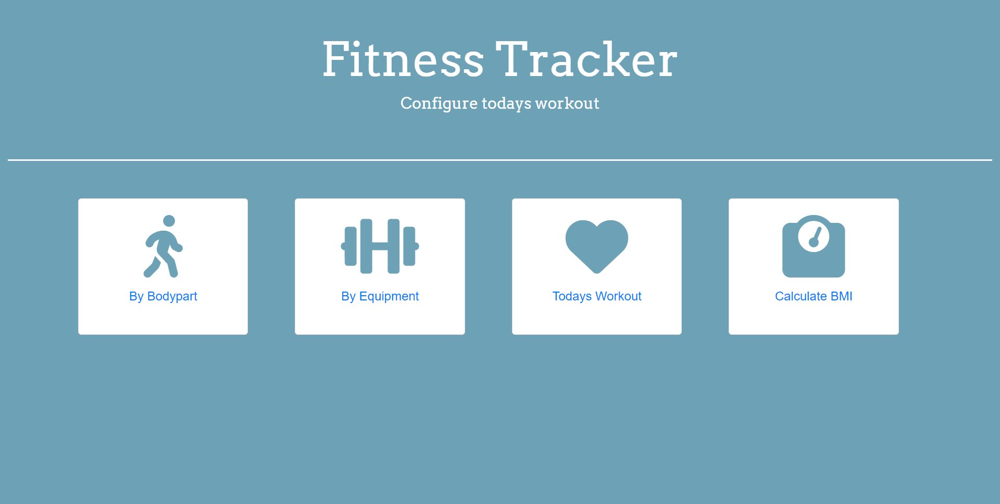

# Fitness-Finder

Our project's aim is to diversify a users workout. We want to introduce new workouts to them and allow them to configure their workout for the day. Additionally we want our users to be able to calculate their BMI and keep a history of how it fluctuates.

## Check out the Project
Check out the different aspects of the project below:

- [GitHub Page](https://johnathanmann.github.io/Fitness-Finder/)
- [Repository](https://github.com/johnathanmann/Fitness-Finder)
- [Video of deployed application](https://drive.google.com/file/d/1RkPbVqRDheqaG5yYhPbYJh5oyySjO4CJ/view)

## User Story

As an active person,
I want to change up my daily workout by finding random workouts that apply to my desired body part or equipment, and I want to keep track of my BMI.

## Credits

Collaborators:
<a href="https://github.com/johnathanmann">Johnathan Mann</a>
<a href="https://github.com/AndresR1010">Andres Rosales</a>
<a href="https://github.com/hanzhang52">Han Zhang</a>

## API's

<a href="https://rapidapi.com/justin-WFnsXH_t6/api/exercisedb/">ExerciseDB</a>
<a href="https://rapidapi.com/principalapis/api/body-mass-index-bmi-calculator/">Body Mass Index (BMI) Calculator</a>